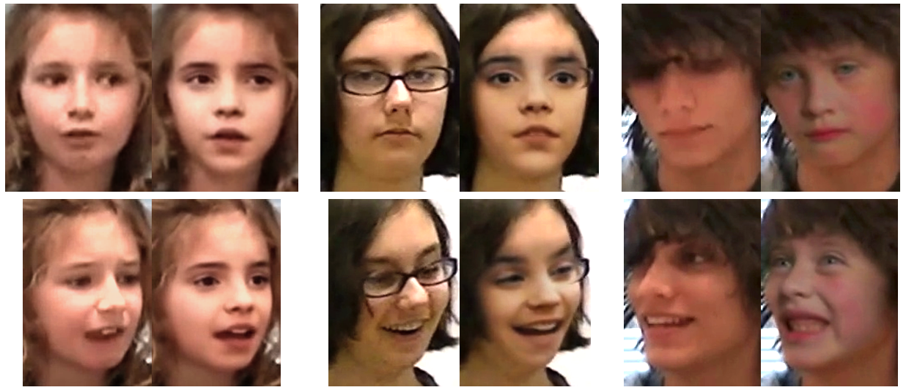
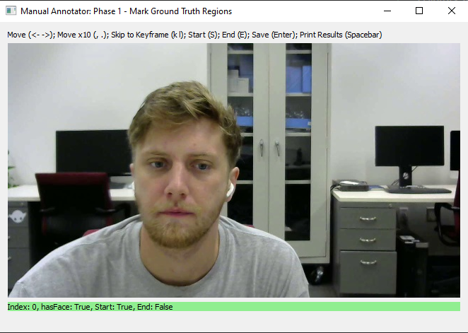
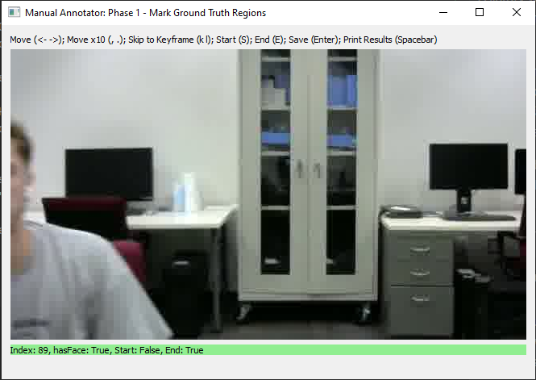
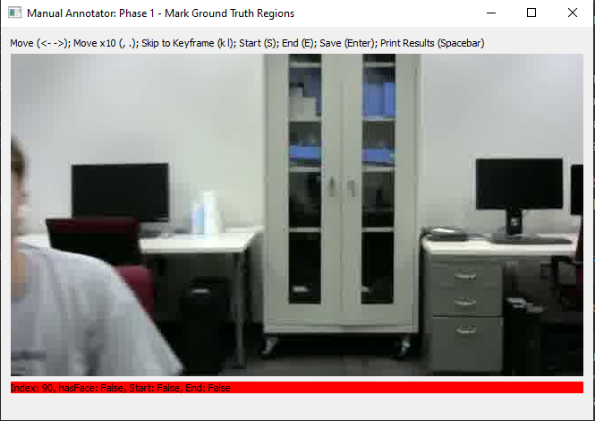
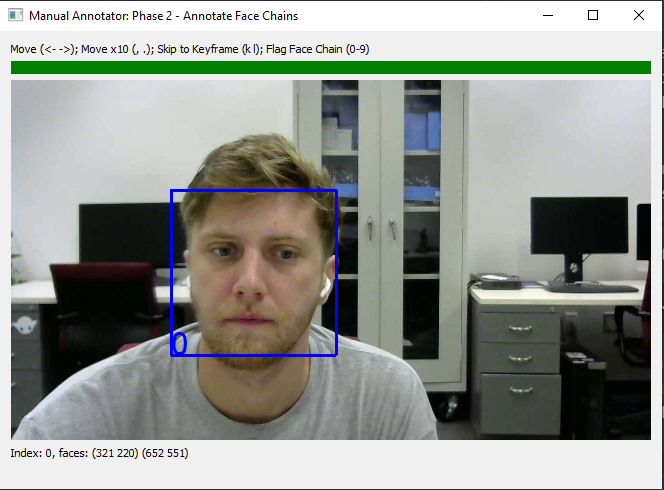
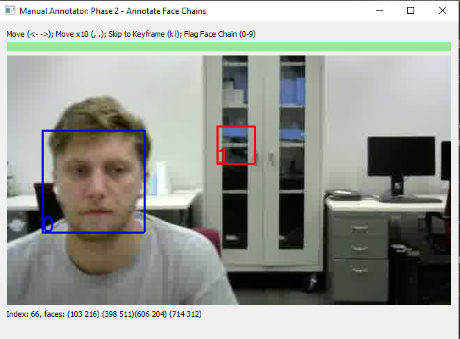

# face-detection-tool

A library which contains multiple automatic face detection methods 
and a manual annotation interface to quickly and accurately mark faces
in video frames.

By combining automatic face detection, sparse manual annotations, and 
heuristic-based interpolations, this tool can quickly achieve full coverage
of a subject's face in challenging video settings, overcoming motion blur 
and occlusions.  

This codebase was used to achieve full coverage when face swapping clinical
behavioral sessions, seen in https://arxiv.org/abs/2204.03559.

    @misc{https://doi.org/10.48550/arxiv.2204.03559,
        doi = {10.48550/ARXIV.2204.03559},
        url = {https://arxiv.org/abs/2204.03559},   
        author = {Wilson, Ethan and Shic, Frederick and Skytta, Jenny and Jain, Eakta}, 
        keywords = {Computer Vision and Pattern Recognition (cs.CV), Artificial Intelligence (cs.AI), FOS: Computer and information sciences, FOS: Computer and information sciences},  
        title = {Practical Digital Disguises: Leveraging Face Swaps to Protect Patient Privacy},  
        publisher = {arXiv},
        year = {2022},
        copyright = {Creative Commons Attribution 4.0 International}
    }

---

To begin, download the codebase off of github by either downloading the zipped file 
under the green code button or using

    git clone https://github.com/ethanrwilson1998/face-detection-tool.git

It is recommended to use a virtual python environment when downloading this repo.  Either 
a python virtual environment or using a package manager like anaconda/miniconda.  __Recommended 
to use conda.__

---

To use a virtual environment with pip, run the following commands (https://docs.python.org/3/tutorial/venv.html):

- from the root directory, create the environment:
    
        python -m venv venv
        
- activate the environment:

    - on Windows:
        
            venv\Scripts\activate.bat
    
    - on Unix/Mac:
    
            source venv/bin/activate
        
- install the project requirements:

        pip install -r requirements.txt
        
---

To use a conda environment:

- ensure anaconda or miniconda are downloaded:

    - https://docs.conda.io/projects/conda/en/latest/user-guide/install/download.html
    
- create a conda environment using the provided environment.yml file:

        conda env create -n face-detection-tool --file environment.yml

__For GPU users, it may be easier to install dependencies with anaconda to ensure
pytorch and tensorflow installs can easily detect the GPU.  Using cuda with pip installs
can be a lot of trouble to get working.__

---

# Example Workflow

This is a quick tutorial to show the application's commands, flow, and options.

A short example video is included in the workspace directory.

---

To automatically detect the faces in example_video.mp4 and save them at
example_video.pickle, run the command:

    python automatic_detection.py workspace/example_video.mp4 workspace/example_video.pickle

If the input and output paths given are directories rather than
files, the program will iterate through all video files found in input_path and generate
a corresponding .pickle embedding in output_path 

By default, the project uses s3fd face detection.
To specify the detection method, use -d or --detection_method followed by 
one of the options {s3fd, haar, mtcnn, dfl}.  __NOTE: s3fd and mtcnn can be 
VERY slow on CPU.  If running on CPU, haar cascades are recommended.__

- s3fd is highly accurate and scale invariant 
(https://ieeexplore.ieee.org/document/8237292).
- haar cascades are very fast but less accurate with many false positives
(https://docs.opencv.org/3.4/db/d28/tutorial_cascade_classifier.html).
- mtcnn is highly accurate but can be quite slow 
(https://ieeexplore.ieee.org/abstract/document/7553523).
- dfl integrates with DeepFaceLab's face extraction pipeline to detect faces
using DFL's version of s3fd.  However, this requires a custom DFL repository
co-located to this repository specified at util/dfl_location.py.  __Not
recommended.__  Email ethanrwilson1998@gmail.com to request access to the 
custom version of DFL (https://arxiv.org/abs/2005.05535).

Interpolation can optionally be specified using -i or --interpolation.  This will
look to fill in the gaps between detected faces, looking X frames forward and backward.

The flag -s or --skip_processed_files will skip input files that already have a corresponding
output .pickle file.  This is useful when adding files to a working directory, as only
unprocessed files will be considered.

The flag --device will specify a pytorch device to use (typically "cpu", "gpu", "gpu:0", etc.)
Default is "gpu".  Only used when running s3fd.  Mtcnn uses keras/tensorflow so will 
search for an available GPU using cuda automatically.

---

With embedded face information, the manual annotation tool can be run.  At first run, 
the program must first split the video into frames.  This can optionally be done standalone using:

    python create_frames_directory.py workspace/example_video.mp4 workspace/frames/
    
This option is useful when dealing with large directories and/or long videos, as the frame 
extraction can be done offline or silently before annotation or while annotating other videos.

---

To open the manual annotation GUI, run

    python manual_annotation.py workspace/example_video.mp4 workspace/example_video.pickle workspace/frames
    
For both commands, -s or --scale_factor can specify the scale used when extracting frames
to display.  A scale of 1.5 would make the images 50% larger, for example.

The manual annotation GUI performs through two distinct interfaces sequentially.  The first
pass, labeled "Mark Ground Truth Regions", is used to label the start and end frames in 
which a face appears.  This information is used further down the pipeline to guide the
program on when to attempt interpolation of faces.

Operate the GUI by marking the start of a region with faces with __S__ and the end with __E__.
The bar at the bottom of the GUI will either be colored green or red to indicate the current
status.

Navigate through frames with the left, right arrow keys or skip 10 frames at a time with
", ." keys (which are "< >" just without holding shift).  

Print statistics on the video by pressing the spacebar and save using enter.  __NOTE: you must
save before exiting in order for the next pass to function properly.  The GUI does not
currently autosave.__

When you close the first GUI using the red X at the top right, the second GUI will automatically
open.

---

The second pass, labeled "Annotate Face Chains" allows the user to label the key subject of
the video, eliminate false positives, and manually add new faces to assist the automatic 
interpolation pass that follows.  

In this pass, face chains are labeled with a number inside their bounding box.  By pressing
the corresponding key, the entire chain is toggled on and off.  For example, pressing the "0"
key on frame 0 will also label the face on future frames as long as the frames are linked to
the same face chain.  

Navigation controls are the same, with a new option of "k, l" to navigate to "keyframes", 
which are frames where a face chain starts/ends or where the annotations from the previous 
pass mark start or end of ground truth regions.  

The top bar again denotes whether the current frame is within a ground truth region.  Now,
dark green denotes that the current frame is a key frame.

When going through this phase, faces of the non-key-subjects can be marked out as well as 
false positive detections.  Extra faces can also be added in to fill in the gaps.

To create a new face annotation, drag the mouse to create the intended bounding box.  Then,
press the Tab key to create the new face annotation.

Typically, the most important regions to manually "fill in the gaps" on are any key frames
that do not contain labeled faces, and regions where the subject moves often.  In the 
interpolation that follows, the gaps are filled between two closest face labels.  So, if 
there is non-linear or large movement between automatic annotations, manual labels should be
added in between to ensure full coverage.

Again, __work must be saved using enter.__

When the GUI is closed, the final interpolation is run.  This interpolation considers the
blue key subject faces that have been automatically and manually created, and interpolates
between them within ground truth regions.

---

There is functionality to blur the faces that were detected or to generate debug videos.

To generate a blurred output video, run
    
    python render_result.py workspace/example_video.mp4 workspace/blurred_video.mp4 workspace/example_video.pickle -b subject_face
    
The parameter -b or --blur has options {none, subject_face, all_faces, whole_frame}.

The parameter -i or --intensity determines the strength of the blur (lower values are more intense).  
Default 10.

The parameter -d or --debug has options {'none', 'boxes', 'neighbors', 'boxes+neighbors', 'keypoints'},
rendering different debug overlays to visualize the labeled faces.

---

To build upon this framework, you may wish to analyze these labeled faces after processing.
The code needed to do so would look something like this (workspace/pull_face_data_example.py):

    from passes.pickle_pass import PickleDecodePass
    from util.objects import VideoData
    from util.video_processor import VideoProcessor
    
    
    if __name__ == "__main__":
    
        input_path, pickle_path = 'workspace/example_video.mp4', 'workspace/example_video.pickle'
    
        video_data = VideoData(input_path, "")
        frames = []
    
        processor = VideoProcessor([
            PickleDecodePass(video_data, frames, path=pickle_path),
        ])
    
        processor.process()
        
        # after processing, frames object has been populated with the embeddings found at
        # 'workspace/example_video.pickle'
    
        print(f'number of frames: {len(frames)}')
        print(f'face 0 at frame 0: {frames[0].faces[0]}')
        
Output should look like:

>Reading serialized data from workspace/example_video.pickle
>
>number of frames: 338
>
>face 0 at frame 0: face at (321, 220) with size (331, 331)
>
    
Further details of the FrameData, Face, DetectedObject, etc. can be seen in utils/objects.py

# License
MIT license. See LICENSE for additional details.

# Citation

If you use this code to assist with an academic publication, please cite our work as:

    @misc{https://doi.org/10.48550/arxiv.2204.03559,
        doi = {10.48550/ARXIV.2204.03559},
        url = {https://arxiv.org/abs/2204.03559},   
        author = {Wilson, Ethan and Shic, Frederick and Skytta, Jenny and Jain, Eakta}, 
        keywords = {Computer Vision and Pattern Recognition (cs.CV), Artificial Intelligence (cs.AI), FOS: Computer and information sciences, FOS: Computer and information sciences},  
        title = {Practical Digital Disguises: Leveraging Face Swaps to Protect Patient Privacy},  
        publisher = {arXiv},
        year = {2022},
        copyright = {Creative Commons Attribution 4.0 International}
    }
    
Related face detection publications are:

    @INPROCEEDINGS{8237292,  
        author={Zhang, Shifeng and Zhu, Xiangyu and Lei, Zhen and Shi, Hailin and Wang, Xiaobo and Li, Stan Z.},  
        booktitle={2017 IEEE International Conference on Computer Vision (ICCV)},   
        title={S^3FD: Single Shot Scale-Invariant Face Detector},   
        year={2017},  
        volume={},  
        number={},  
        pages={192-201},  
        doi={10.1109/ICCV.2017.30}}
    
    @ARTICLE{7553523,  
        author={Zhang, Kaipeng and Zhang, Zhanpeng and Li, Zhifeng and Qiao, Yu},  
        journal={IEEE Signal Processing Letters},   
        title={Joint Face Detection and Alignment Using Multitask Cascaded Convolutional Networks},   
        year={2016},  
        volume={23},  
        number={10},  
        pages={1499-1503},  
        doi={10.1109/LSP.2016.2603342}}